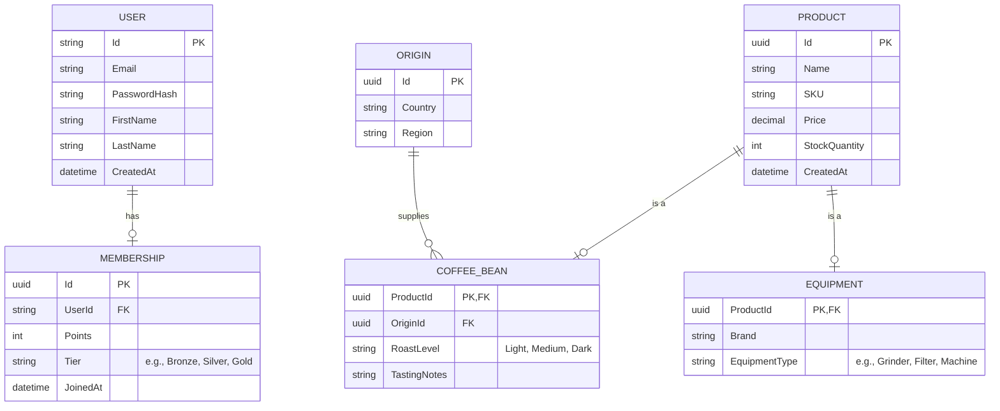

# Coffee Shop Backend API

This is a backend API system for a Coffee Shop built with **.NET 10** and **Entity Framework Core**. It covers product catalog management for coffee beans and equipment, and includes a built-in membership registration and login system based on JWT (JSON Web Token).

## Tech Stack

* **Framework**: .NET 10 (ASP.NET Core Web API)
* **Database**: SQLite (used for rapid local development, easily switchable to PostgreSQL/SQL Server)
* **ORM**: Entity Framework Core (Code-First Approach)
* **Authentication**: ASP.NET Core Identity + JWT Bearer Token
* **API Documentation**: Supports both Swagger and Scalar UI

---

## Entity-Relationship Diagram (ERD)

The database architecture design is shown below. The `Product` entity uses the **TPT (Table-Per-Type)** inheritance design pattern. Specific attributes for "Coffee Beans" and "Equipment" are separated into individual tables and linked to the main `Product` table via the `ProductId` foreign key.



### Note on Database Tables vs ERD

When you inspect the actual generated database (e.g., using DBeaver or SQLite extensions), you will notice several tables starting with `AspNet...` and `__EF...` that are not explicitly drawn in the conceptual ERD above.

* **`AspNetUsers`**: This is the physical representation of the `USER` entity in the ERD. It contains our custom fields (`FirstName`, `LastName`, `CreatedAt`) alongside the built-in authentication fields (`Email`, `PasswordHash`).
* **`AspNetRoles`, `AspNetUserRoles`, `AspNetUserClaims`, etc.**: These are infrastructure tables automatically generated by **ASP.NET Core Identity**. They provide a robust, production-ready foundation for handling Role-Based Access Control (RBAC), Claims, and third-party logins (like Google/Apple) without needing to build them from scratch.
* **`__EFMigrationsHistory` & `__EFMigrationsLock`**: These are tracking tables used by Entity Framework Core to manage database schema versions and prevent migration conflicts.

### Deep Dive: ASP.NET Core Identity Infrastructure

To better understand how ASP.NET Core Identity works behind the scenes, here is an explanation of the core concepts using a Coffee Shop analogy:

#### 1. Roles
**Concept: Think of this as a "Job Title" (e.g., Customer, Barista, Admin).**
* **`AspNetRoles`**: Stores the list of available job titles.
* **`AspNetUserRoles`**: A mapping table that connects a user to a role (e.g., Teddy is an Admin).
* **Usage**: You can easily restrict access to certain API endpoints by checking their roles.

#### 2. Claims
**Concept: Think of this as specific details on an "ID Card" or a "Special Permit".**
While Roles are broad, Claims are highly specific key-value pairs (e.g., `Age: 25`, `CanOperateEspressoMachine: true`).
* **`AspNetUserClaims`**: Stores specific attributes belonging to a user.
* **`AspNetRoleClaims`**: Stores attributes that everyone with a certain Role automatically gets.
* **Usage**: Allows for fine-grained access control without creating overly specific Roles.

#### 3. Logins (Third-Party Authentication)
**Concept: Like using a Google account to link to your membership.**
* **`AspNetUserLogins`**: If a user decides to register or log in using Google, Facebook, or Apple, this table links your local `AspNetUsers` account to that external provider ID.

#### 4. Tokens (One-Time Security Codes)
**Concept: Like a temporary number ticket.**
*(Note: This is different from the JWT used for API authentication).*
* **`AspNetUserTokens`**: This table stores temporary, internal system codes (e.g., password reset tokens, email verification links).

---

## Getting Started

### 1. Run the Project

Open your terminal, navigate to the project directory, and run the following command to start the server:

```bash
dotnet run
```

### 2. Test the API

Once the server is running, you can explore and test the API endpoints using either of the following interfaces:

* **Swagger UI**: `http://localhost:5046/swagger`
* **Scalar UI (Recommended)**: `http://localhost:5046/scalar/v1`

### 3. Authentication Testing (Auth API)

Currently, the following two Minimal API endpoints are available for testing authentication:

* `POST /api/auth/register`: Register by providing Email, Password, FirstName, and LastName.
* `POST /api/auth/login`: Log in by providing Email and Password. Upon success, a **JWT Token** will be returned, which can be used to authorize subsequent API requests.

### 4. Database Migrations

The project currently uses SQLite as the local database and an initial Migration has been generated. If you modify the C# entity structures in the `Models` directory, please run the following commands to update the database:

```bash
# Add a new migration record (e.g., named AddNewTable)
dotnet ef migrations add AddNewTable

# Apply the changes to the database
dotnet ef database update
```
